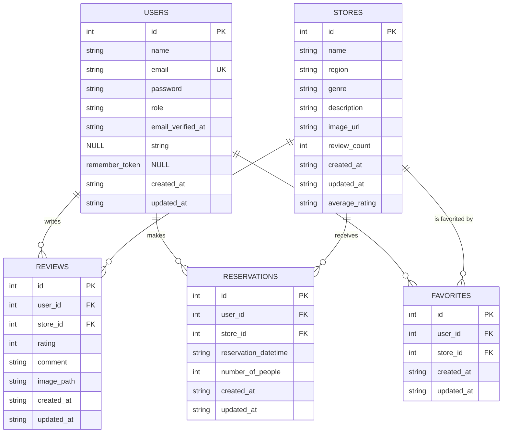

# 店舗情報・口コミサイト

## 概要

店舗情報とユーザーによる店舗一覧ソート機能、口コミ追加・編集、管理者によるcsvインポート機能を備えた Web アプリケーションです。

## 使用技術

-   **PHP:** 8.2 (Dockerfile を参照)
-   **フレームワーク:** Laravel 11.x
-   **データベース:** MySQL 8.0.39
-   **Web サーバー:** Nginx 1.27.2
-   **フロントエンド:** Vite, Node.js (v18 推奨)
-   **コンテナ仮想化:** Docker, Docker Compose

## 環境構築 (Docker)

### 必要なもの

-   Docker
-   Docker Compose
-   Node.js (v18 以上推奨)
-   npm (または yarn)

-   **Node.js と npm:**
    -    Node.js v18を利用するために、**Node Version Manager (`nvm`)** を使用してインストールすることを推奨します。
    -   **nvm のインストール (未インストールの場合):**
        ```bash
        # nvmのインストールスクリプトを実行 (公式の最新コマンドを確認してください)
        curl -o- https://raw.githubusercontent.com/nvm-sh/nvm/v0.39.7/install.sh | bash

        # ターミナルを再起動するか、以下のコマンドでnvmを読み込む
        export NVM_DIR="$([ -z "${XDG_CONFIG_HOME-}" ] && printf %s "${HOME}/.nvm" || printf %s "${XDG_CONFIG_HOME}/nvm")"
        [ -s "$NVM_DIR/nvm.sh" ] && \. "$NVM_DIR/nvm.sh"
        ```
    -   **nvm を使用した Node.js (v18) のインストール:**
        ```bash
        nvm install 18
        nvm use 18
        # npmも同時にインストールされます
        ```

### 手順

1.  **(ホストマシン) リポジトリのクローン:**
    ```bash
    git clone <リポジトリURL>
    cd <リポジトリ名>
    ```

2.  **(ホストマシン) 環境変数の設定:**
    ```bash
    cp src/.env.example src/.env
    ```
    必要に応じて `.env` ファイル内のデータベース接続情報 (`DB_DATABASE`, `DB_USERNAME`, `DB_PASSWORD`) やアプリケーション設定 (`APP_URL` など) を編集してください。`compose.yaml` で設定されたデフォルト値と一致させる必要があります。

3.  **(ホストマシン) Node.js 依存関係のインストール:**
    `package.json` が存在する **`src` ディレクトリ内** で以下を実行します。
    ```bash
    cd src
    npm install
    # または yarn install
    cd ..
    ```

4.  **(ホストマシン) Docker コンテナのビルドと起動:**
    プロジェクトルートで以下を実行します。
    ```bash
    docker compose up -d --build
    ```

5.  **(ホストマシン) PHP コンテナへのアクセス:**
    ```bash
    docker compose exec php bash
    ```

6.  **(PHP コンテナ内) Composer パッケージのインストール:**
    `/var/www` ディレクトリ内で実行します。
    ```bash
    composer install
    ```

7.  **(PHP コンテナ内) アプリケーションキーの生成:**
    ```bash
    php artisan key:generate
    ```

8.  **(PHP コンテナ内) データベースマイグレーションと初期データ投入:**
    ```bash
    php artisan migrate:fresh --seed
    ```

9.  **(PHP コンテナ内) ストレージリンクの作成:**
    ```bash
    php artisan storage:link
    ```

10. **(PHP コンテナ内) コンテナからの退出:**
    ```bash
    exit
    ```

11. **(ホストマシン) Vite 開発サーバーの起動:**
    開発時にフロントエンドの変更をリアルタイムに反映させるには、**`src` ディレクトリ内** で Vite 開発サーバーを起動します。
    ```bash
    cd src
    npm run dev
    # または yarn dev
    # 終了する場合は Ctrl+C
    ```

    **(本番環境やビルドする場合)**
    本番環境向けに最適化された静的なアセットファイルを生成する場合は、代わりに **`src` ディレクトリ内** で以下のコマンドを実行します。
    ```bash
    cd src
    npm run build
    # または yarn build
    ```

これで環境構築は完了です。

## ER 図



## URL

-   **開発環境:** [http://localhost/](http://localhost/) (または `.env` の `APP_URL`)
-   **phpMyAdmin:** [http://localhost:8080/](http://localhost:8080/)

## ログイン情報 (シーディング後)

-   **管理者ユーザー:**
    -   メールアドレス: `admin@example.com`
    -   パスワード: `password`
-   **一般ユーザー:**
    -   メールアドレス: `user@example.com`
    -   パスワード: `password`
    -   (その他、`UserSeeder` で生成されたユーザーもパスワードは `password` です)

## 利用方法

### ユーザー

-   **ユーザー登録・ログイン:** ヘッダーのリンクから行えます。
-   **店舗一覧・詳細:** トップページ (`/`) で店舗一覧が表示されます。「詳しく見る」で詳細ページに移動します。
-   **店舗検索・ソート:** 店舗一覧ページのヘッダーにあるフォームで以下の操作が可能です。
    *   **並び替え:**
        *   ランダム (デフォルト)
        *   評価が高い順
        *   評価が低い順
        *   お気に入り (要ログイン)
    *   **絞り込み:**
        *   地域 (All area, 東京都, 大阪府, 福岡県)
        *   ジャンル (All genre, 寿司, 焼肉, イタリアン, 居酒屋, ラーメン)
        *   キーワード (店舗名、地域、ジャンル、概要の部分一致)
-   **お気に入り:** 店舗カードや詳細ページでハートマークをクリックするとお気に入り登録/解除が可能です。（要ログイン）
-   **予約:** 店舗詳細ページの右側フォームから予約を行えます。（要ログイン）
-   **口コミ投稿:**
    -   口コミを投稿するには、以下の**すべて**の条件を満たす必要があります。
        1.  **ログインしている**こと。
        2.  **口コミを投稿したい店舗を予約している**こと。
        3.  予約時に指定した**来店日時 (`reservation_datetime`) を過ぎている**こと。
        4.  **まだその店舗に口コミを投稿していない**こと。
    -   上記の条件を満たす場合、店舗詳細ページの右下に「口コミを投稿する」ボタンが表示されます。
-   **口コミ編集・削除:** 自分が投稿した口コミは、店舗詳細ページの口コミ欄に表示される「編集」「削除」ボタンから操作できます。（要ログイン）

### 管理者

-   **ログイン:** 上記の管理者アカウント情報でログインします。
-   **CSVインポート:** ログイン後、ヘッダーの「CSVインポート」を選択し、`/admin/import/csv` ページにアクセスします。
    -   指定されたフォーマット (`店舗名,地域,ジャンル,店舗概要,画像URL`) の CSV ファイル (UTF-8) をアップロードすることで、新規店舗情報を一括登録できます。
    -   バリデーションエラーがある場合は、エラー内容が表示され、登録は行われません。
    -   サンプル CSV として `import_stores_success.csv` (正常系) と `import_stores_error.csv` (エラー系) がプロジェクトルートにあります。
-   **口コミ削除:** 管理者はすべての口コミを削除できます（店舗詳細ページから）。

## テスト

PHPUnit を使用した Feature テストが実装されています。
主要な機能である口コミ、店舗一覧ソート、CSVインポートに関するテストが含まれています。

### 実装済みテスト

-   **`tests/Feature/ReviewTest.php`**: 口コミの投稿、編集、削除に関するロジックと権限（投稿者本人、管理者）のテストをカバーしています。画像アップロードやバリデーション、1ユーザー1店舗1口コミ制限などもテストします。
-   **`tests/Feature/StoreSortTest.php`**: 店舗一覧ページの表示、評価（高低順、評価なし店舗の扱い）、お気に入り順、ランダム順でのソート機能、および評価平均・レビュー数の表示に関するテストをカバーしています。
-   **`tests/Feature/CsvImportTest.php`**: 管理者による店舗情報のCSVインポート機能に関するテストをカバーしています。正常系のインポート、権限チェック、ファイル形式・サイズ・内容のバリデーション、エラー時のトランザクション（ロールバック）などをテストします。

### テストの実行方法

1.  **(ホストマシン) PHP コンテナ内に入る:**
    ```bash
    docker compose exec php bash
    ```

2.  **(PHP コンテナ内) テストを実行する:**
    プロジェクトのルート (`/var/www`) で実行します。
    ```bash
    php artisan test
    ```

    特定のテストファイルのみを実行したい場合は、ファイルパスを指定します。
    ```bash
    php artisan test tests/Feature/ExampleTest.php
    ```

    特定のメソッドのみを実行したい場合は、`--filter` オプションを使用します。
    ```bash
    php artisan test --filter=test_example_method
    ```

## トラブルシューティング

### パーミッションエラー

Docker 環境では、ホストとコンテナ間でファイルの所有権が衝突し、パーミッションエラーが発生することがあります。以下に一般的な対処法を示します。

*   **`npm run dev` で `EACCES: permission denied` エラーが出る場合:**
    `src/node_modules` の所有権をホストユーザーに変更します。
    ```bash
    sudo chown -R $(id -u):$(id -g) src/node_modules
    ```
    その後、`src` ディレクトリで `npm run dev` を再試行してください。

*   **アプリ表示時に `Please provide a valid cache path.` や書き込みエラーが出る場合:**
    コンテナ内の `storage`, `bootstrap/cache` ディレクトリの所有者を Web サーバー (通常 `www-data`) に変更し、権限を修正します。
    ```bash
    docker compose exec php sh -c "chown -R www-data:www-data storage bootstrap/cache && chmod -R 775 storage bootstrap/cache"
    ```

    **注意:** `chmod 777` の使用はセキュリティリスクを高めるため、上記の方法を推奨します。